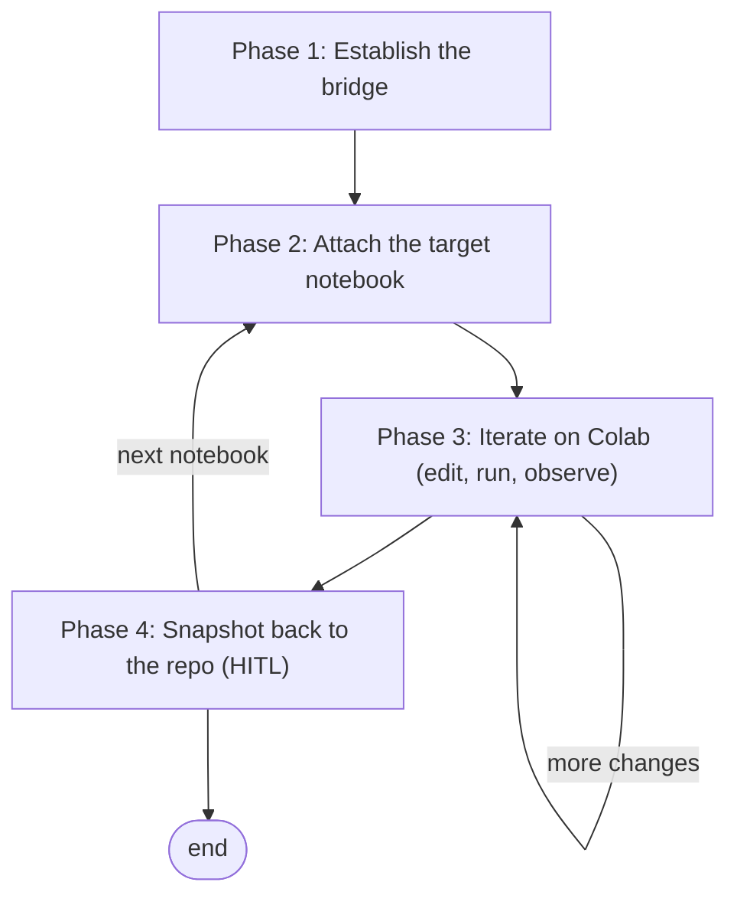

# Colab MCP Integration Workflow

This workflow defines how to run `twitter_ai` notebooks on **Google Colab's cloud runtime** (with access to Drive-mounted datasets and optional GPUs) while keeping the **git repository as the single source of truth**. The [Colab MCP server](https://github.com/googlecolab/colab-mcp) bridges the local agent to a Colab notebook open in the browser, exposing tools to add, edit, run, and read cells. The recurring problem it solves: iterating on a notebook against the real (multi-million-row) tweet datasets requires Colab's runtime, but Colab notebooks live in Drive and drift from their versioned counterparts in the repo. This workflow closes that loop — author canonical cells in the repo, execute them live on Colab, then snapshot results back — so the repo notebook and its executed output never silently diverge.

It differs from [notebooks/notebook_setup.md](../notebooks/notebook_setup.md) (which defines the *internal* structure every notebook must have) by governing the *outer loop* of how a session moves a notebook between the repo and Colab.

**Execution model:** loop — a per-notebook cycle of attach → iterate (edit + run) → snapshot, repeated until the notebook is complete.

**Prerequisites:**
- Colab MCP registered in [.mcp.json](../.mcp.json) at project scope and showing `✓ Connected` (`claude mcp list`).
- `uv` installed locally (the server runs via `uvx`).
- The MCP client `timeout` set above `60000` (the connect handshake waits up to 60 s); this project uses `90000`.
- Signed into the Google account whose Drive holds `My Drive/Colab Projects/AI Public Trust`.
- The target notebook follows [notebooks/notebook_setup.md](../notebooks/notebook_setup.md) — `RUNNING_LOCALLY = False`, `drive.mount`, and the `git clone` cell for `src` imports.

**Referenced skills:** [notebooks/notebook_setup.md](../notebooks/notebook_setup.md) — the canonical per-notebook Setup section this workflow assumes is already in place.

---

## Flow



Phase 1 runs once per session to open the bridge. Phase 2 attaches a specific notebook and is re-entered whenever switching notebooks (the bridge drives one notebook at a time). Phase 3 is the iterative edit/run loop. Phase 4 pulls executed state back to git and is human-gated on the commit.

---

## Phase 1 — Establish the bridge

Open the local-to-browser bridge once per working session and record the pairing credentials the rest of the session reuses. The bridge accepts a **single** Colab connection, so any notebook driven later must carry the same token and port.

### Step 1.1 — Open the connection

Call the injected connect tool. It spawns a scratch `empty.ipynb` Colab tab carrying a one-time pairing token, then waits up to 60 s for that tab to hand-shake back.

```text
mcp__colab-mcp__open_colab_browser_connection()   # returns {"result": true} on success
```

If it returns `false` or times out, see Troubleshooting.

### Step 1.2 — Capture the token and port

The pairing token is a server-side secret; it is **not** logged. Read it from the address bar of the scratch tab that just opened:

```text
https://colab.research.google.com/notebooks/empty.ipynb#mcpProxyToken=<TOKEN>&mcpProxyPort=<PORT>
```

Record `<TOKEN>` and `<PORT>` — they are stable for the life of the MCP server process and are reused verbatim in Phase 2 to attach any notebook.

---

## Phase 2 — Attach the target notebook

Point the bridge at the notebook you actually want to run. Loading any Colab tab with the Phase 1 fragment makes that tab take over the single connection.

The bridge holds **one** connection at a time. Before opening a new notebook, **close the currently-connected Colab tab** — otherwise the new tab is rejected with a `too many open connections` error. Closing the old tab frees the slot; the token/port are unchanged, so the same fragment attaches the new tab.

### Step 2.1 — Choose the notebook source

| Source | URL base | Trade-off |
|:---|:---|:---|
| GitHub (reflects pushed repo state) | `https://colab.research.google.com/github/IgnacioOQ/twitter_ai/blob/main/<path>` | Cannot save back to GitHub; snapshot via Phase 4 |
| Drive copy | `https://colab.research.google.com/drive/<fileId>` | Autosaves to Drive; risks divergence from git |
| Scratch (new exploration) | `https://colab.research.google.com/notebooks/empty.ipynb` | Ephemeral; build cells via MCP, then write into the repo |

Prefer the **GitHub** source for existing repo notebooks so Colab loads exactly what git holds.

### Step 2.2 — Open with the pairing fragment

Append the Phase 1 fragment to the chosen URL and open it (a fresh tab is cleanest):

```text
<notebook-url>#mcpProxyToken=<TOKEN>&mcpProxyPort=<PORT>
```

### Step 2.3 — Confirm the attachment

Verify the bridge is now driving the intended notebook before touching cells:

```text
mcp__colab-mcp__get_cells(includeOutputs=false)   # should list the target notebook's cells, not the empty scratch cell
```

If a GPU is needed, set **Runtime → Change runtime type → GPU** in the Colab tab; the bridge survives the reconnect.

---

## Phase 3 — Iterate on Colab (edit, run, observe)

Run and refine the notebook against the live runtime. Canonical *code* changes are authored in the repo `.ipynb` (via `NotebookEdit`) and mirrored onto Colab; Colab is the executor, not the author of record.

### Step 3.1 — Run the Setup section

Execute the notebook's Setup cells first (`drive.mount`, `git clone`, imports) so paths and `src` imports resolve, exactly as [notebooks/notebook_setup.md](../notebooks/notebook_setup.md) specifies. Mounting Drive triggers a one-time auth prompt in the Colab tab.

**Missing dependencies.** The Colab base image periodically drops packages the notebooks assume (e.g. `gensim`). On a `ModuleNotFoundError`, add a Colab-guarded install cell and re-run — this fix is part of what Phase 4 snapshots back:

```text
if not RUNNING_LOCALLY:
    !pip install -q <package>
```

Do **not** pin a transitive dependency down (e.g. `scipy<1.13`) to force compatibility — on current Colab that downgrades `numpy` and breaks the runtime. Install the package plain; if a version change to `numpy`/`scipy` is genuinely needed, install it, then **Runtime → Restart session** (the bridge survives a kernel restart) and re-run.

### Step 3.2 — Edit and execute

Use the Colab MCP tools against the attached notebook:

```text
mcp__colab-mcp__add_code_cell(cellIndex, language="python", code=...)
mcp__colab-mcp__update_cell(cellId, content=...)
mcp__colab-mcp__run_code_cell(cellId)             # returns stdout / outputs
mcp__colab-mcp__get_cells(cellIndexStart, cellIndexEnd, includeOutputs=true)
```

Keep any *code* change reflected in the repo `.ipynb` so git stays canonical. Loop within this phase until the cells behave as intended.

### Step 3.3 — Driving long-running cells

Cell execution is **decoupled from the MCP call**: `run_code_cell` returns after ~90 s even though the cell keeps running on the Colab kernel. A heavy cell — a full-dataset pass, `drive.mount` waiting on auth, a large `write_gml` — therefore surfaces as a `timed out after 90s` error while it is in fact **still executing**. Do **not** re-run it; that would queue a second execution behind the first.

Instead, poll the cell:

```text
mcp__colab-mcp__get_cells(cellIndexStart=<n>, cellIndexEnd=<n>, includeOutputs=true)
```

- **Still running** while `execution_count` is `null`; the latest `tqdm`/stderr line (e.g. `31%|███ | 11271996/36560405 …`) streams into the cell's outputs after it has run a while (it may be empty for the first several seconds).
- **Done** when `execution_count` flips from `null` to a number and the final `print`ed output appears.
- **Crashed** if an `error` output with a traceback appears — check for this rather than assuming "still running".

Cells run **sequentially on one kernel**, so you cannot slip a separate check cell in while a long one runs — it queues behind it. Poll the running cell itself. For multi-hour cells, check back on a timer instead of holding the call open.

---

## Phase 4 — Snapshot back to the repo

```yaml
hitl_gate: true
```

**Mandatory before leaving a notebook — do not skip.** Snapshot the *executed* notebook back into the repo **before** switching to another notebook (re-entering Phase 2) or ending the session. A GitHub-loaded notebook cannot be saved back to GitHub, and Colab does not auto-save it to Drive, so **closing or switching its tab permanently discards the executed state** — printed outputs, rendered plots, and any cells added or modified live during Phase 3. Capturing that state is the whole point of the loop; treat an un-snapshotted notebook as unfinished work, and never close its tab until Step 4.2 has written its executed cells into the repo `.ipynb`.

Reconcile the executed notebook into git, then let the human approve the commit. This is the gate that keeps git authoritative; a human must confirm the diff and authorize any `git` write (per repository policy, every commit is approved on its own).

### Step 4.1 — Pull the executed state

Retrieve the final cells (and, if the run is worth preserving, their outputs) from Colab:

```text
mcp__colab-mcp__get_cells(includeOutputs=true)
```

### Step 4.2 — Write into the repo notebook

Reconcile the retrieved cells into the repo `.ipynb` with `NotebookEdit`. For a GitHub-loaded notebook this captures the run; for a Drive-loaded notebook it re-establishes git as the source of truth over the Drive copy.

### Step 4.3 — Human-approved commit

Present the notebook diff and the one-line intent. On approval, commit and (if desired) push so the next Colab open from GitHub reflects the update. Do not run any `git` write without explicit approval.

---

## Example — End-to-end on one notebook

Running [notebooks/06_Experiments/01_tp_bigrams_test.ipynb](../notebooks/06_Experiments/01_tp_bigrams_test.ipynb) on Colab and snapshotting the result back to git.

```text
# Phase 1 — bridge (once per session)
open_colab_browser_connection()                    -> {"result": true}
# read scratch tab address bar:
#   ...empty.ipynb#mcpProxyToken=Qw7ZAv7MTNAlclZ6DOJxng&mcpProxyPort=52974
# record TOKEN=Qw7ZAv7MTNAlclZ6DOJxng  PORT=52974

# Phase 2 — attach the repo notebook from GitHub
# open in browser:
#   https://colab.research.google.com/github/IgnacioOQ/twitter_ai/blob/main/notebooks/06_Experiments/01_tp_bigrams_test.ipynb#mcpProxyToken=Qw7ZAv7MTNAlclZ6DOJxng&mcpProxyPort=52974
get_cells(includeOutputs=false)                    -> lists the notebook's real cells

# Phase 3 — run the experiment (Drive not needed here, so skip the mount cell)
run_code_cell(<gensim cell id>)                    -> ModuleNotFoundError: No module named 'gensim'
# fix live: insert a Colab-guarded install cell
add_code_cell(cellIndex=1, language="python",
              code='if not RUNNING_LOCALLY:\n    !pip install -q gensim')
run_code_cell(<install cell id>)                   -> gensim installed
# Runtime -> Restart session (only if a pip install changed numpy/scipy), then:
run_code_cell(<gensim cell id>)                    -> Topic 0: ... / Topic 1: ... (LDA topics)

# Phase 4 — snapshot back to git (HITL)
get_cells(includeOutputs=true)                     -> final cells + outputs
# NotebookEdit the repo .ipynb to match, then:
#   -> present diff, get approval, commit
```

The token and port above are illustrative — read the current session's values from the scratch tab (Step 1.2).

---

## Decision Points & Branches

| Condition | Action |
|:---|:---|
| Switching to a different notebook | **Snapshot the current notebook first (Phase 4)** — closing its tab discards executed state — then re-enter Phase 2 with the same token/port; the new tab takes over the single connection |
| Exploratory work with no repo notebook yet | Build cells in the scratch notebook (Phase 3), then create a repo `.ipynb` in Phase 4 |
| MCP server restarted (developer reload) | Token/port are regenerated — redo Phase 1 to get fresh values |
| Heavy compute (embeddings, LDA grid) | Set GPU runtime in Step 2.3 before running Phase 3 |

---

## Future Extension — Google Drive MCP

A [Google Drive MCP](https://github.com/isaacphi/mcp-gdrive) may later be incorporated to streamline the parts this workflow still handles manually — chiefly **shuttling small artifacts** (a trained classifier, a topic-model output, a results CSV) between Drive and the repo without hand-downloading. It is **out of scope for now**: code sync is already handled by git (`git clone` on Colab / GitHub loader / local edits), and the large tweet datasets must stay in Drive behind `drive.mount` rather than route through an MCP. Adopt a Drive MCP only if artifact-fetching becomes a recurring friction; the Colab MCP plus git remains the backbone.

---

## Quick Reference Checklist

- [ ] Colab MCP `✓ Connected`; `timeout` > 60000.
- [ ] Phase 1 done: `open_colab_browser_connection()` returned `true`; TOKEN and PORT recorded.
- [ ] Phase 2 done: target notebook opened with the pairing fragment; `get_cells` confirms the right notebook.
- [ ] Setup section run on Colab (Drive mounted, `src` cloned, imports OK).
- [ ] Iteration complete; code changes reflected in the repo `.ipynb`.
- [ ] Executed state snapshotted back to git **before closing/switching the tab** (GitHub-loaded notebooks lose outputs on close); commit human-approved.

---

## Troubleshooting

| Symptom | Cause | Fix |
|:---|:---|:---|
| Connect tool times out at 30 s | MCP client `timeout` shorter than the 60 s handshake | Set `timeout` to `90000` in `.mcp.json`, reload the client |
| Connect returns `false` | Scratch tab did not load / not signed in | Ensure the spawned Colab tab finishes loading while signed into Google, retry |
| No `#mcpProxyToken=...` in the scratch tab | Colab stripped the fragment | Redo Phase 1; if still absent, the token is unrecoverable — work in the scratch notebook and Save-a-copy to Drive |
| `too many open connections` when opening a notebook | The previous Colab tab still holds the single connection | Close the currently-connected tab, then re-open the new notebook URL with the fragment |
| `get_cells` shows the empty scratch cell, not your notebook | The target tab never took over the connection | Re-open the notebook URL with the correct token/port fragment (Phase 2) |
| `get_cells` keeps showing the scratch cell **and** closing the scratch tab makes every tool return `Unknown tool` | The GitHub-loaded notebook tab never seized the single connection because it was **not connected to a runtime** (the scratch tab auto-connects; a fresh GitHub notebook does not). Closing scratch then leaves no connected tab, so the bridge drops entirely | In the notebook tab, **Connect to a runtime first** (top-right, wait for the green check), *then* close the scratch tab, *then* re-navigate the notebook URL **with** the `#mcpProxyToken=…&mcpProxyPort=…` fragment so it grabs the freed slot. The port stays live for the server's life, so the notebook tab reconnects without redoing Phase 1 (Phase 2) |
| `open_colab_browser_connection` returns `true` but **every** editing tool stays `Unknown tool` across repeated attempts (the server keeps toggling connected/disconnected) | The MCP **server process itself** has degraded from repeated open / close / developer-reload cycles — the editing tools never register even though `open` reports success. A browser reconnect *or* a developer reload does **not** recover it | **Fully restart Claude Code** (kills and respawns the MCP server), close all stale `empty.ipynb` scratch tabs, then redo Phase 1 on a clean slate. Do **not** keep calling `open_colab_browser_connection` to retry — each call spawns another scratch tab that competes for the single connection slot and worsens the state |
| Bridge won't recover and you need results now | The bridge only automates the drive-from-Claude loop; it is never the *only* way to run — git holds the notebook and Drive holds the data/artifacts | Open the notebook on Colab **from GitHub** (Phase 2 URL — no fragment needed just to run it), Connect a runtime, and run the cells by hand. Snapshot any new outputs back per Phase 4. Falling back to a manual run loses only the automation, not the work |
| `ModuleNotFoundError` on Colab (e.g. `gensim`) | Colab base image dropped the package | Add a `if not RUNNING_LOCALLY: !pip install -q <pkg>` cell, re-run (Step 3.1) |
| `No module named 'numpy.rec'` / numpy version mismatch after a pip install | A pinned dependency downgraded numpy/scipy | Remove the pin (install plain); Runtime → Restart session, then re-run — the bridge survives |
| `CUDA available: False` for heavy work | Runtime is CPU | Runtime → Change runtime type → GPU, then reconnect |
| Tools disappear after a reload | MCP server restarted; token/port changed | Redo Phase 1 for fresh credentials |
| `run_code_cell` returns `timed out after 90s` on a heavy cell | The MCP call caps at ~90 s; the cell keeps executing on the kernel | Don't re-run. Poll `get_cells(includeOutputs=true)`; done when `execution_count` flips from `null` to a number (Step 3.3) |
| No `tqdm` progress bar while a long cell runs | stderr streams through the bridge with lag and isn't in the tool's return value | Poll `get_cells(includeOutputs=true)` — the latest stderr line appears in the cell's outputs once it has run a while |
| Bridge lost after rearranging the Colab tab | The tab was closed or reloaded | Moving a tab to a new window is safe; only close/reload drops pairing — redo Phase 2 to re-attach |
