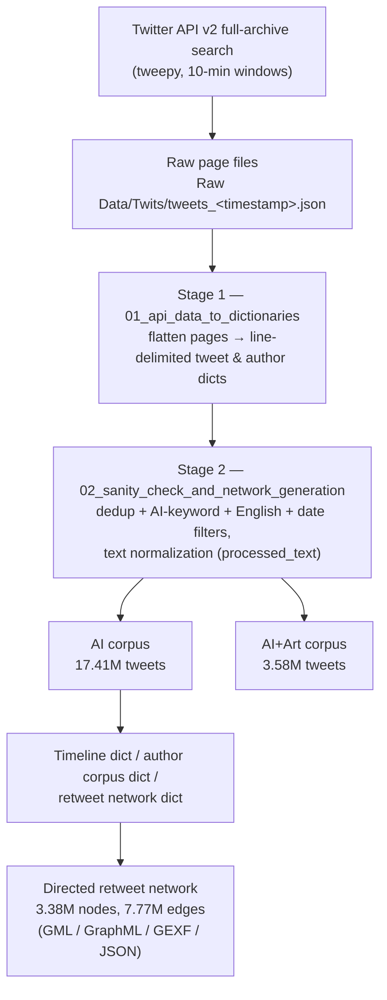

# Dataset Preprocessing Pipeline & Summary Statistics

This document reports, end to end, how the **AI Public Trust** Twitter dataset was collected, preprocessed, and turned into author-interaction networks, and gives the summary statistics of the resulting corpus. It is written to be exhaustive; a blog post can be distilled from it.

The numbers come from the full-data Colab run of the pipeline (executed August 2026). The machine-readable master summary is [notebooks/02_Processing/dataset_statistics_summary.json](../notebooks/02_Processing/dataset_statistics_summary.json) (mirrored from `Data Sets/Cleaned Data/dataset_statistics_summary.json` on Google Drive).

## Pipeline Overview



Notebooks: [01_Ingestion/02_twitter_api_mining.ipynb](../notebooks/01_Ingestion/02_twitter_api_mining.ipynb) → [02_Processing/01_api_data_to_dictionaries.ipynb](../notebooks/02_Processing/01_api_data_to_dictionaries.ipynb) → [02_Processing/02_sanity_check_and_network_generation.ipynb](../notebooks/02_Processing/02_sanity_check_and_network_generation.ipynb).

## 1. Data Collection (Twitter API)

Tweets were mined with **tweepy** against the Twitter API v2 **full-archive search** endpoint (`search_all_tweets`, academic access), paginated at `max_results=500` per request with a limit of 2,000 requests per window, sweeping the collection period in **10-minute time windows** whose results are dumped as one JSON file per window (`Raw Data/Twits/tweets_<ISO timestamp>.json`).

**Search query** (English-only at the API level):

```text
(ChatGPT OR Chat-GPT OR GPT OR GPT-3 OR GPT3 OR GPT-4 OR GPT4 OR BARD
 OR (Bing AI) OR LLMs OR LLM OR AI OR AGI OR (artificial intelligence)
 OR (large language models) OR LaMDA OR PaLM OR Med-PaLM OR BERT OR LLaMA) lang:en
```

**Fields requested per tweet:** `id`, `text`, `created_at`, `author_id`, `public_metrics`, `entities`, `possibly_sensitive`, `conversation_id`, `referenced_tweets`, `lang`.
**Fields requested per user:** `id`, `name`, `username`, `created_at`, `public_metrics`, `verified`, `description`, `entities`, `location`.
**Expansions:** `author_id`, `referenced_tweets.id`, `referenced_tweets.id.author_id` — so every page carries an `includes` section with the *referenced* tweets and all involved user objects. This is what later allows retweet edges to be resolved to the referenced tweet's author.

## 2. Stage 1 — From API Pages to Tweet & Author Dictionaries

[01_api_data_to_dictionaries.ipynb](../notebooks/02_Processing/01_api_data_to_dictionaries.ipynb) flattens the paged API responses into two **line-delimited JSON** files (one record per line): `AItrust_twits_dict.json` and `AItrust_author_dict.json` (plus `_test` counterparts built from a single test file).

Each tweet record keeps a fixed subset of API fields via `process_tweet()`:

| Field | Source / rule |
|---|---|
| `id`, `text`, `created_at`, `author_id`, `public_metrics` | copied from the API object |
| `type` | `referenced_tweets[0].type` if present (`retweeted` / `replied_to` / `quoted`), else `'original'` |
| `referenced_tweets` | the id of the first referenced tweet (if any) |
| `referenced_tweets_dictionary` | the *full processed record* of the referenced tweet, resolved from the page's `includes.tweets`; `'N/A'` if unresolvable |
| `conversation_id`, `entities` | copied when present (`entities` holds hashtags, mentions, URLs, and the API's NER annotations) |

Two details of this stage matter downstream:

- **Extension tweets are written too.** Both the page's `data` tweets and its `includes.tweets` (the referenced tweets pulled in by the expansions) are processed and written. This enriches coverage but is the main source of **duplicate tweet ids** in the raw dictionaries (the same tweet appears as data in one page and as a referenced tweet in many others). Overlapping 10-minute windows contribute as well. Deduplication is deferred to Stage 2.
- **Author records are written verbatim** from `includes.users`, one line per appearance (also with duplicates), keeping keys `description`, `public_metrics`, `created_at`, `id`, `entities`, `name`, `username`, `verified`.

## 3. Stage 2 — Pruning (Content, Language, Date)

[02_sanity_check_and_network_generation.ipynb](../notebooks/02_Processing/02_sanity_check_and_network_generation.ipynb) reads the raw tweet dictionary in a **single streaming pass** and writes two pruned corpora simultaneously, tracking a complete funnel. Rationale: the expansion mechanism drags in referenced tweets that predate the collection window or contain no AI terminology at all, so the raw file is much noisier than the query suggests.

Filters are applied **in order**; each dropped tweet is counted against the *first* filter it fails:

**3.1 Validity.** Records with a missing `id` or empty `text` are dropped. (Full run: 0 such records.)

**3.2 Deduplication.** A tweet id already written is skipped (`seen_written` set). Full run: **8,494,403 duplicates** skipped; 36,560,405 raw lines contained 25,637,570 unique ids.

**3.3 AI-keyword filter.** The tweet text must match at least one of:

- a **core keyword pattern** (case-insensitive, word-bounded): `ChatGPT`, `Chat-GPT`, `GPT`/`GPT3`/`GPT-3`/`GPT4`/`GPT-4`, `LLM`/`LLMs`, `BARD`, `BERT`, `LaMDA`, `LLaMA`, `Med-PaLM`, `Bing AI`, `artificial intelligence`, `large language models`. Bare `AI`/`AGI` are deliberately **excluded** from this pattern because they over-match inside ordinary words (`daily`, `aging`);
- an **allowed AI form**: standalone `AI` (not preceded by an apostrophe, excluding French *j'ai*/*l'ai*), `#AI…`, `@AI…`, or hyphenated `AI-<word>` (e.g. *AI-powered*, *#AIart*);
- an **allowed AGI form**: standalone `AGI`, `#AGI…`, `@AGI…`, `AGI-<word>`;

subject to a **denylist**: any hashtag/mention token matching `#airdrop*` / `@airdrop*` (crypto-spam that superficially matches `#AI…`) rejects the tweet. Full run: **10,429,950 dropped** for lacking AI terminology — these enter the dataset only because a genuinely-matching tweet referenced them.

**3.4 English-language filter.** A tweet passes if the API's `lang` field starts with `en`, **or** if it passes the `seems_english()` heuristic (needed because referenced tweets pulled in via expansions escape the query's `lang:en` operator). The heuristic first strips URLs, mentions, and hashtags, then:

- *All texts:* require ≥ 5 ASCII characters and ≥ 75% ASCII share among alphanumeric/punctuation characters; reject if > 6% of letters are accented (byte range 128–255).
- *Short texts* (< 40 chars after cleaning): additionally screened against a curated Spanish/French/Portuguese stopword list (~150 high-signal function words); ≥ 1 hit making up ≥ 25% of tokens ⇒ rejected. `langdetect` is skipped (too noisy on short strings).
- *Longer texts* (≥ 40 chars): `langdetect` is tried first — a prediction with probability ≥ 0.85 decides (accept EN / reject non-EN); on low confidence it falls through to the same stopword screen with looser thresholds (≥ 2 hits and ≥ 30% of tokens ⇒ rejected).

Full run: **76,363 dropped** as non-English.

**3.5 Date cutoff.** `created_at` must be **on or after 2022-10-31** (UTC, date-level comparison). This removes referenced tweets predating the study window (some by years). Full run: **149,654 dropped**; kept tweets span **2022-10-31 → 2023-02-27** (120 days).

The funnel is exactly additive: 8,494,403 + 10,429,950 + 76,363 + 149,654 + 17,410,035 = 36,560,405.

## 4. Text Processing

Every kept tweet gets a `processed_text` field alongside the untouched raw `text`, produced by `preprocess()`:

1. lowercase the text;
2. strip a leading `rt ` retweet marker;
3. remove URLs entirely (`http…` tokens);
4. remove `@mentions` entirely, including the trailing colon of RT headers (`@user:`);
5. strip the `#` symbol but **keep the hashtag word** (`#AIart` → `aiart`);
6. replace newlines with spaces and collapse all whitespace runs to single spaces; trim.

Hashtags are additionally recoverable in original casing via `extract_hashtags()` on the raw text, and the API's `entities` field preserves the original hashtag/mention/URL annotations.

**Text hygiene statistics** (AI corpus, 17,410,035 tweets):

| Metric | Value | Share of corpus |
|---|---:|---:|
| Tweets containing URLs | 6,941,574 | 39.9% |
| Tweets containing @mentions | 13,503,243 | 77.6% |
| Tweets containing hashtags | 4,738,899 | 27.2% |
| Total raw characters | 2,489,897,755 | — |
| Total processed characters | 1,986,610,596 | — |
| Average tweet length (raw → processed) | 143.0 → 114.1 chars | −20.2% |

The high mention share (77.6%) reflects the corpus's typology: every retweet carries an `RT @user:` header.

> **Downstream variant.** A later notebook ([03_cleaning_tweets.ipynb](../notebooks/02_Processing/03_cleaning_tweets.ipynb)), operating on the sentiment-augmented corpus, uses a *different* normalization intended for language models: URLs → the token `http`, mentions → the token `@user` (placeholders instead of removal). The two schemes should not be conflated when describing "the" cleaned text.

## 5. The Two Corpora

The single pruning pass writes two nested corpora:

- **AI corpus** — `AItrust_twits_pruned_dict.json`: everything passing §3. **17,410,035 tweets, 4,775,711 unique authors** (47.6% of raw lines).
- **AI+Art corpus** — `AItrust_Art_pruned_twit_dict.json`: the subset whose raw text additionally matches at least one of **60 unique art/creative keywords** from [keywords.txt](../notebooks/02_Processing/keywords.txt) (case-insensitive, whole-word): art, artists, creativity, anime, film, music, comedy, satire, creative, copyright, author(ship), aesthetic, style, propaganda, erotic, image(s), photograph(y), print, portrait, expression, soul, emotion, gallery, draw, paint, movie, picture, character, artwork, illustration/illustrator, musician, fiction, NFT, ugly, beautiful, curate/curator/curation, theft, plagiarism, imagination, craft, meaning, sculpture, collage, performance, dance, theatre, stage, plus named studios/creators (Disney, Pixar, Nintendo, Hayao Miyazaki, Wes Anderson, Studio Ghibli, Hideo Kojima). **3,583,101 tweets, 1,440,802 unique authors** (9.8% of raw lines; 20.6% of the AI corpus).

## 6. Master Funnel & Corpus Statistics

**Timeframe:** 2022-10-31 → 2023-02-27 (120 days; cutoff on or after 2022-10-31).

| Funnel stage | Count | % of raw |
|---|---:|---:|
| Raw records scanned | 36,560,405 | 100% |
| Unique tweet IDs seen | 25,637,570 | 70.1% |
| Duplicates dropped | 8,494,403 | 23.2% |
| Dropped — no AI keyword | 10,429,950 | 28.5% |
| Dropped — non-English | 76,363 | 0.2% |
| Dropped — before cutoff | 149,654 | 0.4% |
| **AI corpus kept** | **17,410,035** | **47.6%** |
| **AI+Art corpus kept** | **3,583,101** | **9.8%** |

**Tweet typology (AI corpus)** — from the `type` field assigned in Stage 1:

| Type | Count | Share |
|---|---:|---:|
| Original | 4,061,626 | 23.3% |
| Retweeted | 9,638,407 | 55.4% |
| Replied to | 3,221,048 | 18.5% |
| Quoted | 488,954 | 2.8% |
| Exceptions | 0 | — |
| **Total** | **17,410,035** | 100% |

**Author populations:**

| Population | Unique authors |
|---|---:|
| AI corpus | 4,775,711 |
| AI+Art corpus | 1,440,802 |
| Retweet interaction graph | 3,379,040 |

## 7. Network Generation

**Derived structures.** A second streaming pass over the AI corpus builds three dictionaries, pickled to Drive:

- `full_timeline_dict.pkl` — tweet id → `created_at` (used for the daily-volume timeline histogram);
- `full_author_corpus_dict.pkl` — author id → list of that author's raw tweet texts (input for author-level text modeling);
- `full_network_dict.pkl` — the retweet adjacency structure described next.

**Retweet network construction.** Only tweets with `type == 'retweeted'` (9,638,407 tweets) generate edges. For each, the retweeting `author_id` and the retweeted author (`referenced_tweets_dictionary.author_id`, available thanks to the ingestion expansions) are read, and a nested counter `network_dict[retweeted_author][retweeting_author] += 1` is accumulated. The graph is then materialized as a **weighted directed NetworkX `DiGraph`**:

- **Nodes** are authors, named by `str(author_id)` (author id is the node identity; in GML exports it becomes each vertex's `label` attribute, while the GML `id` is just an integer index).
- **Edges** point **retweeter → retweeted author**, with `weight` = number of times that retweeter retweeted that author. Consequently weighted **in-degree = retweets received** (influence/reach) and weighted **out-degree = retweets made** (amplification activity).
- Self-loops are possible (authors retweeting themselves) and are not filtered at this stage.

Replies and quotes are *not* edges in this graph — `type_of_network = 'retweeted'` is a parameter, so reply/quote networks can be generated by the same code.

**Serialization.** The graph is exported to four formats — `Full_Network.gml`, `.graphml`, `.gexf`, and `.json` (node-link) — each verified by an immediate read-back and node/edge-set equality check against the in-memory graph (all passed).

**Full network topology:**

| Metric | Value |
|---|---:|
| Author nodes | 3,379,040 |
| Directed edges (unique retweeter→retweeted pairs) | 7,768,720 |
| Total edge weight (retweet volume) | 9,638,407 |
| Weakly connected components | 49,464 |
| Largest WCC | 3,264,499 nodes (96.61%) |

The giant component covering 96.6% of authors indicates a single, densely interconnected retweet conversation rather than fragmented communities of discourse.

**Top 10 most-retweeted authors (weighted in-degree)** and **top 10 most active retweeters (weighted out-degree):**

| Rank | Author id (retweeted) | Retweets received | Author id (retweeter) | Retweets made |
|---:|---|---:|---|---:|
| 1 | 1156482001 | 92,733 | 1356588046616043527 | 45,503 |
| 2 | 44196397 | 81,395 | 935446829730291717 | 18,696 |
| 3 | 1556992059575128065 | 77,583 | 1264433760 | 9,396 |
| 4 | 856155592578158592 | 69,858 | 1565280726156804099 | 8,366 |
| 5 | 23359932 | 57,161 | 1576344842585645058 | 8,117 |
| 6 | 1345102860732788740 | 48,608 | 709564705304498176 | 7,912 |
| 7 | 1059462898953515009 | 48,593 | 190097582 | 7,520 |
| 8 | 1552871185431527424 | 44,214 | 737142202481016832 | 7,098 |
| 9 | 247180104 | 42,353 | 770285228929712128 | 6,704 |
| 10 | 1618937075218219009 | 40,835 | 992943418052460544 | 6,640 |

**Test network** (from the small test dataset; pipeline validation only): 446 nodes, 334 edges, weight 363, 122 weakly connected components, largest 32 nodes (7.17%).

## 8. Provenance & Artifacts

- **Compute:** full run executed on Google Colab against Drive-hosted data. Pruning pass ≈ 2h12m wall time (36.5M records at ~4,700 rec/s); network-dict pass ≈ 17m; graph build + topology stats ≈ 16m.
- **Drive artifacts** (under `My Drive/Colab Projects/AI Public Trust/Data Sets/`):
  - `AItrust_twits_dict.json`, `AItrust_author_dict.json` — Stage 1 outputs (raw dictionaries);
  - `Cleaned Data/AItrust_twits_pruned_dict.json` (AI corpus), `Cleaned Data/AItrust_Art_pruned_twit_dict.json` (AI+Art corpus);
  - `Cleaned Data/full_pruning_stats.json`, `full_basic_counts_dict.pkl`, `full_timeline_dict.pkl`, `full_author_corpus_dict.pkl`, `full_network_stats.json`;
  - `Cleaned Data/dataset_statistics_summary.json` — master summary (mirrored into this repo at [notebooks/02_Processing/](../notebooks/02_Processing/dataset_statistics_summary.json));
  - `Networks/full_network_dict.pkl`, `Networks/Full_Network.{gml,graphml,gexf,json}`;
  - `_test`-suffixed counterparts of all of the above from the test-dataset branch.
- **Caveats worth stating in the blog post:**
  - The raw-side funnel percentages are relative to *records scanned*, which double-count tweets (duplicates from expansions and overlapping windows); relative to *unique* tweets, retention is 17.41M / 25.64M ≈ 67.9%.
  - `GPT` and `BERT` as bare keywords can admit rare false positives (e.g. the name "Bert"); the English heuristic is intentionally permissive toward ASCII-heavy non-English tweets that pass all screens.
  - The `AI+Art` keyword list mixes generic aesthetic terms (*style*, *meaning*, *soul*, *character*) with art-domain ones, so that corpus is a high-recall, moderate-precision slice; downstream classifiers (notebooks/05_Classifiers) exist to refine it.
